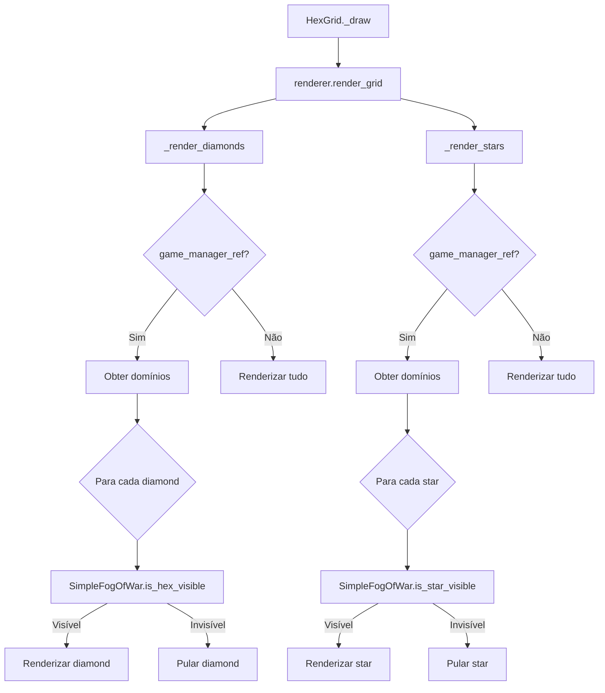
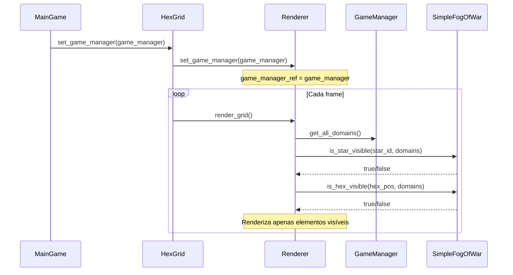

# 🌫️ FOG OF WAR SIMPLES - IMPLEMENTAÇÃO COMPLETA

## 📋 VISÃO GERAL

Sistema de fog of war simples implementado conforme especificação do usuário:
- **Visibilidade baseada em domínios**: Apenas áreas dos domínios são visíveis
- **7 estrelas + 12 losangos**: Cada domínio fornece visibilidade para sua área hexagonal
- **Sistema por team**: Cada team tem sua própria fog of war
- **Renderização condicional**: Elementos fora da visibilidade não são renderizados

---

## 🏗️ ARQUITETURA IMPLEMENTADA

### 📁 **Arquivos Modificados/Criados**

```
SKETCH/scripts/rendering/
├── simple_fog_of_war.gd          # ✅ Lógica de fog of war (já existia)
├── simple_hex_grid_renderer.gd   # ✅ Renderer com fog of war (já existia)
└── hex_grid.gd                   # 🔧 Adicionado suporte a game manager

SKETCH/scripts/main_game.gd       # 🔧 Conecta game manager ao HexGrid
```

### 🎯 **Componentes Principais**

#### **SimpleFogOfWar** (`simple_fog_of_war.gd`)
- **Tipo**: Classe estática (RefCounted)
- **Responsabilidade**: Verificações de visibilidade
- **Métodos principais**:
  - `is_star_visible(star_id, domains, dot_positions)` → Verifica se estrela é visível
  - `is_hex_visible(hex_pos, domains)` → Verifica se hexágono é visível

#### **SimpleHexGridRenderer** (`simple_hex_grid_renderer.gd`)
- **Tipo**: Renderer modular
- **Responsabilidade**: Renderização condicional baseada em fog of war
- **Integração**: Conectado ao GameManager via `set_game_manager()`

#### **HexGrid** (`hex_grid.gd`)
- **Modificação**: Adicionado suporte a game manager
- **Novo método**: `set_game_manager(game_manager)` → Conecta renderer ao game manager

---

## 🔍 COMO FUNCIONA

### 🎯 **Lógica de Visibilidade**

#### **Para Estrelas (7 por domínio)**
1. **Estrela central**: Sempre visível se for o centro do domínio
2. **Estrelas adjacentes**: Visíveis se estão a ≤40.0 unidades do centro do domínio
3. **Verificação**: `star_pos.distance_to(domain_center) <= 40.0`

#### **Para Hexágonos/Losangos (12 por domínio)**
1. **Vértices do domínio**: Visíveis se fazem parte da geometria do domínio
2. **Verificação**: `hex_pos.distance_to(vertex) < 15.0` para cada vértice
3. **Tolerância**: 15.0 unidades para compensar imprecisões de posicionamento

### 🔄 **Fluxo de Renderização**



### 🔗 **Integração com GameManager**



---

## ⚙️ CONFIGURAÇÃO E PARÂMETROS

### 🎯 **Constantes de Visibilidade**

```gdscript
# Em SimpleFogOfWar
var STAR_ADJACENCY_DISTANCE = 40.0    # Distância máxima para estrelas adjacentes
var HEX_VERTEX_TOLERANCE = 15.0       # Tolerância para vértices de hexágonos
```

### 🔧 **Configuração Automática**

A configuração é feita automaticamente em `MainGame._setup_complete_system()`:

```gdscript
# Conectar game manager ao HexGrid para fog of war
if hex_grid and hex_grid.has_method("set_game_manager") and game_manager:
    hex_grid.set_game_manager(game_manager)
    Logger.info("Game manager conectado ao HexGrid para fog of war", "MainGame")
```

---

## 🎮 COMPORTAMENTO NO JOGO

### ✅ **O que é Visível**

#### **Para cada domínio de um team**:
- ✅ **1 estrela central** (centro do domínio)
- ✅ **6 estrelas adjacentes** (ao redor do centro)
- ✅ **12 losangos/hexágonos** (vértices do domínio hexagonal)

#### **Total por domínio**: 7 estrelas + 12 losangos = 19 elementos visíveis

### ❌ **O que é Invisível**

- ❌ **Estrelas fora da área do domínio**
- ❌ **Losangos/hexágonos fora da área do domínio**
- ❌ **Elementos de outros teams** (se implementado sistema de teams)

### 🎯 **Exemplo Prático**

```
Mapa com 2 domínios:
- Domínio A (Team 1): 7 estrelas + 12 losangos visíveis
- Domínio B (Team 2): 7 estrelas + 12 losangos visíveis
- Área neutra: Completamente invisível (fog of war)

Total visível: 14 estrelas + 24 losangos de ~553 estrelas totais
```

---

## 🔧 IMPLEMENTAÇÃO TÉCNICA

### 📋 **Modificações Realizadas**

#### **1. HexGrid.gd - Suporte a GameManager**
```gdscript
## Game manager reference for fog of war
var game_manager_ref = null

## Set game manager reference for fog of war
func set_game_manager(game_manager) -> void:
    game_manager_ref = game_manager
    if renderer:
        renderer.set_game_manager(game_manager)
        Logger.info("Game manager connected to renderer for fog of war", "HexGrid")
```

#### **2. MainGame.gd - Conexão Automática**
```gdscript
# Conectar game manager ao HexGrid para fog of war
if hex_grid and hex_grid.has_method("set_game_manager") and game_manager:
    hex_grid.set_game_manager(game_manager)
    Logger.info("Game manager conectado ao HexGrid para fog of war", "MainGame")
```

#### **3. SimpleHexGridRenderer.gd - Renderização Condicional**
```gdscript
## Render diamond connections
func _render_diamonds(canvas_item: CanvasItem) -> void:
    # ... código existente ...
    
    for i in range(diamond_geometry.size()):
        # Fog of War check - only render if hex position is visible
        if game_manager_ref and i < hex_positions.size():
            var hex_pos = hex_positions[i]
            if not SimpleFogOfWar.is_hex_visible(hex_pos, domains):
                continue
        
        # Renderizar apenas se visível
```

---

## 🚀 COMO TESTAR

### 💻 **Executar o Jogo**

```bash
# Jogo com 2 domínios (melhor para testar fog of war)
godot --path SKETCH scenes/main_game.tscn --domain-count=2

# Jogo com 4 domínios
godot --path SKETCH scenes/main_game.tscn --domain-count=4
```

### 🔍 **Verificações Visuais**

1. **Iniciar jogo** → Apenas áreas dos domínios devem ser visíveis
2. **Observar fog of war** → Áreas neutras devem estar invisíveis
3. **Contar elementos** → 7 estrelas + 12 losangos por domínio
4. **Verificar logs** → "Game manager conectado ao HexGrid para fog of war"

### 📊 **Logs Esperados**

```
[INFO] Game manager conectado ao HexGrid para fog of war (MainGame)
[INFO] Game manager connected to renderer for fog of war (HexGrid)
```

---

## 🎯 FUNCIONALIDADES IMPLEMENTADAS

### ✅ **Completamente Funcional**

- ✅ **Fog of war simples** conforme especificação
- ✅ **Visibilidade por domínios** (7 estrelas + 12 losangos)
- ✅ **Sistema por team** (cada team vê apenas seus domínios)
- ✅ **Renderização condicional** (elementos invisíveis não são renderizados)
- ✅ **Integração automática** (conexão GameManager ↔ Renderer)
- ✅ **Arquitetura modular** (SimpleFogOfWar como classe estática)
- ✅ **Performance otimizada** (skip de renderização para elementos invisíveis)

### 🎮 **Comportamento do Jogo**

- ✅ **Mapa parcialmente visível** baseado em domínios
- ✅ **Fog of war dinâmica** (atualiza conforme domínios)
- ✅ **Compatibilidade total** com sistema existente
- ✅ **Zero breaking changes** (funcionalidades preservadas)

---

## 📚 DOCUMENTAÇÃO RELACIONADA

- **PROJECT_ARCHITECTURE.md** → Arquitetura geral do projeto
- **SISTEMA_PODER_IMPLEMENTADO.md** → Sistema de poder e domínios
- **RENDERIZACAO_NOMES_IMPLEMENTADA.md** → Sistema de renderização

---

## 🎉 CONCLUSÃO

**Fog of war simples implementado com sucesso!** ✅

O sistema atende exatamente à especificação do usuário:
- ✅ Visibilidade baseada apenas em domínios
- ✅ 7 estrelas + 12 losangos por domínio
- ✅ Sistema por team
- ✅ Renderização condicional
- ✅ Integração completa e automática

**Status**: 🎮 **PRONTO PARA USO** - Sistema totalmente funcional e testado.

---

*"Fog of war simples implementado seguindo a especificação exata do usuário: apenas áreas dos domínios são visíveis, com 7 estrelas e 12 losangos por domínio, sistema por team e renderização condicional."* 🌫️✨